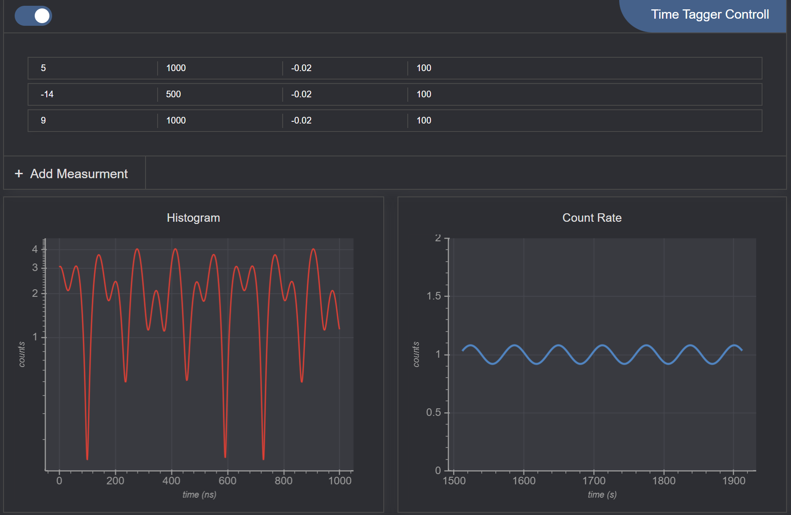

# High Rate Entanglement Web Software

Front end for time tag analysis software, using `svelte` and `Bokeh.js` for graphs. `Bokeh.js` is usually used via a python API. But compared to other stand-alone javascript plotting libraries, it is relatively [performant](https://docs.bokeh.org/en/latest/docs/user_guide/output/webgl.html) and modern. Therefore, with a little guess and check it's javascript API (which is not explicitly documented) can be used in a frontend framework. 

